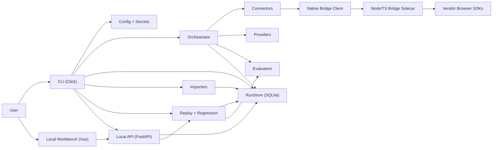
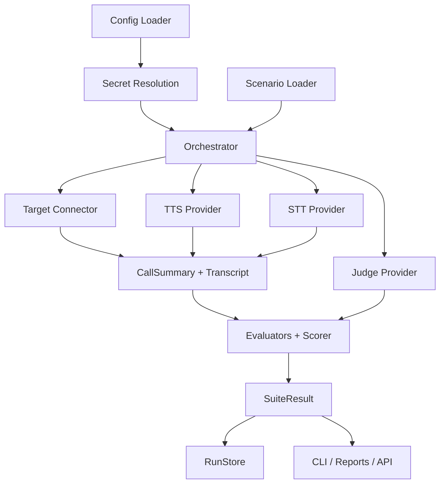
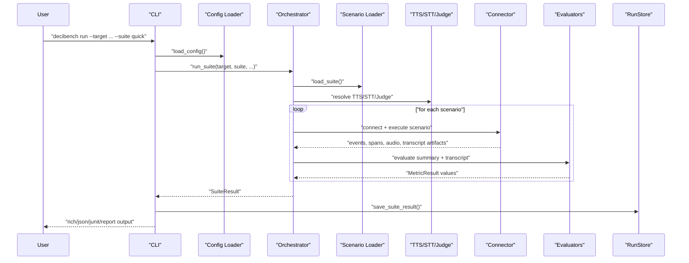
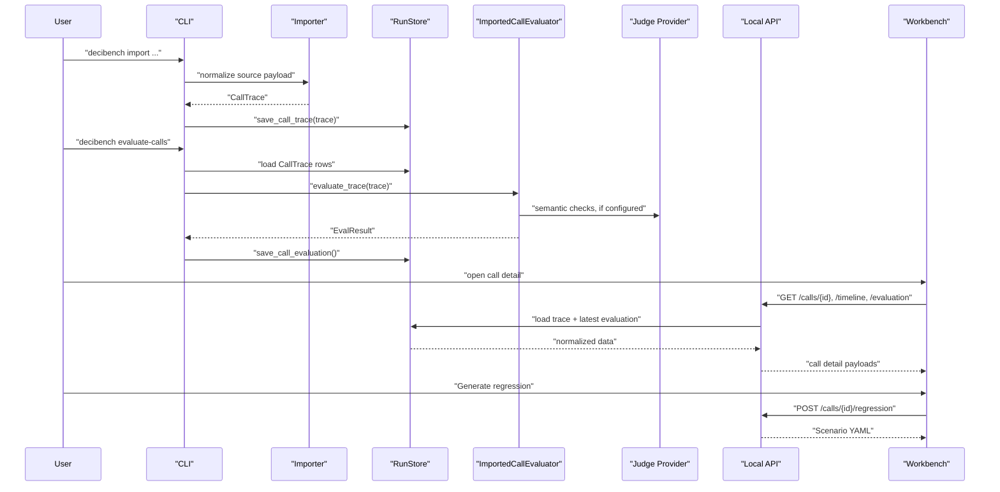
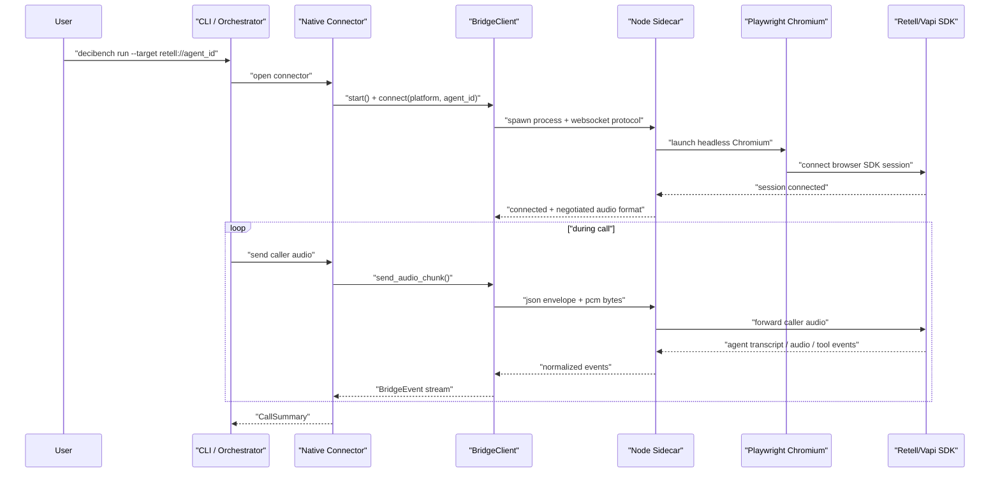
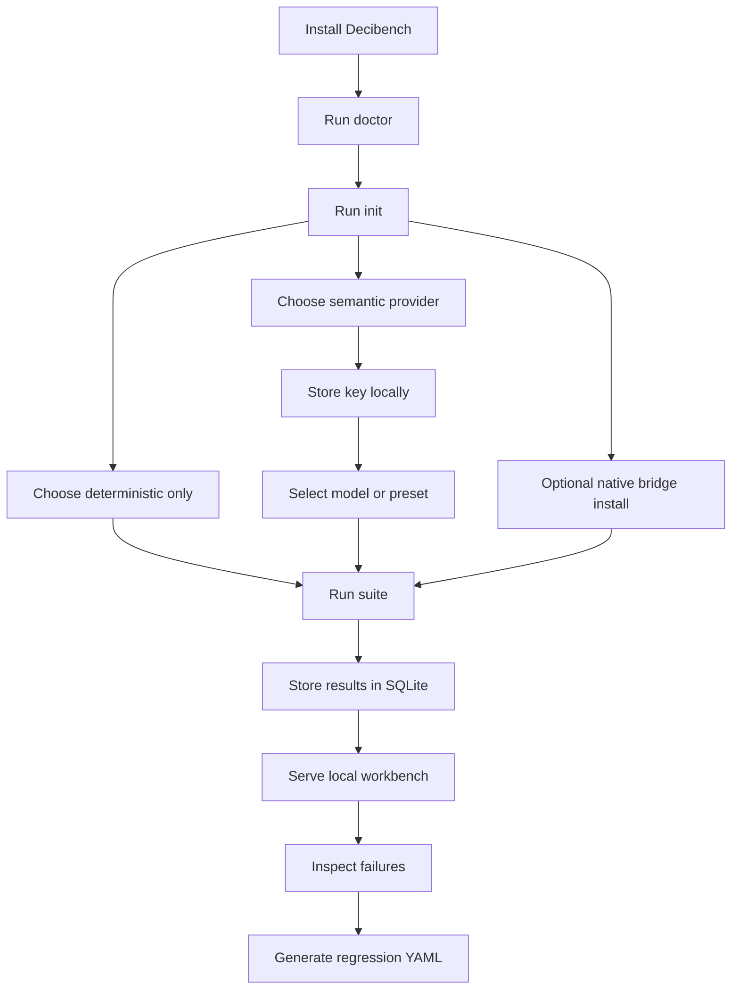

# Decibench Architecture

This document explains Decibench as it exists today: what it is, how the
system is composed, how data moves, how users experience it locally, and where
contributors should extend it.

It is intentionally architecture-first, not marketing-first.

## 1. Purpose

Decibench is a local-first voice agent quality platform with three primary
jobs:

1. run benchmark suites against voice agents
2. import and analyze real calls
3. turn failures into replayable regressions

The product stance is deliberate:

- local-first
- terminal-first
- open-source
- optional-LLM, not LLM-required
- self-hosted workbench, not a hosted SaaS

In practice that means:

- the CLI is the main entry point
- the local API and dashboard are workbench surfaces over the same stored data
- configuration lives in `decibench.toml`
- secrets are resolved locally from environment variables or the OS keyring
- runs, imported calls, and evaluations are persisted in a local SQLite store

## 2. Design Principles

Decibench is built around a few non-negotiable ideas:

### 2.1 One execution engine

The CLI, API, and future automation surfaces should all rely on the same core
execution behavior. The [orchestrator](/Users/atharvaawatade/Desktop/Decibench/src/decibench/orchestrator.py)
is the center of that.

### 2.2 Local-first trust

Users should be able to install the tool, run it, inspect the data, and keep
control of secrets and traces on their own machine.

### 2.3 Deterministic first, semantic second

LLM-based judging is supported, but the system is still useful without it.
This keeps zero-key evaluation possible and makes the product usable in more
environments.

### 2.4 Provider-neutral core

Imported calls, runs, and evaluations are normalized into shared data models so
the rest of the system does not need to care whether the source was demo,
WebSocket, Retell, Vapi, JSONL, or something added later.

### 2.5 Thin surfaces over typed models

The CLI parses arguments, the API shapes responses for the workbench, and the
dashboard consumes those responses. Business logic stays in the core modules.

## 3. System Overview



## 4. Repository Map

The repo has three main product layers plus supporting docs and tests.

### 4.1 Python core

Under [src/decibench](/Users/atharvaawatade/Desktop/Decibench/src/decibench):

- `cli/`: command-line entry points and local UX commands
- `config.py`: config loading, defaults, secret resolution
- `models.py`: shared typed contracts
- `orchestrator.py`: benchmark execution engine
- `connectors/`: agent transport/runtime integrations
- `providers/`: TTS, STT, and judge provider resolution
- `evaluators/`: scoring metrics and semantic checks
- `imports/`: provider/export ingestion into normalized call traces
- `replay/`: imported-call evaluation and regression-scenario generation
- `store/`: SQLite store, migrations, privacy/redaction
- `api/`: local FastAPI server used by the workbench
- `bridge/`: Python client for the native bridge sidecar

### 4.2 Native bridge sidecar

Under [bridge_sidecar](/Users/atharvaawatade/Desktop/Decibench/bridge_sidecar):

- Node/TypeScript bridge process
- Playwright + headless Chromium runtime
- Retell and Vapi browser-side adapters
- platform-neutral WebSocket protocol between Python and the sidecar

### 4.3 Local dashboard

Under [dashboard](/Users/atharvaawatade/Desktop/Decibench/dashboard):

- Vue 3 application
- Vue Router navigation
- TanStack Query for API state
- local failure-inbox and call-detail workbench views

## 5. Core Modules and Responsibilities

### 5.1 CLI

The CLI is registered in [cli/__init__.py](/Users/atharvaawatade/Desktop/Decibench/src/decibench/cli/__init__.py).
It exposes the main product commands:

- `run`
- `compare`
- `init`
- `doctor`
- `auth`
- `models`
- `bridge`
- `serve`
- `import`
- `evaluate-calls`
- `replay`
- `runs`
- `scenario`

The CLI should stay thin. It is responsible for:

- argument parsing
- user prompts
- environment checks
- invoking the core engine or store-backed workflows

It should not become the place where evaluation logic lives.

### 5.2 Configuration and secrets

[config.py](/Users/atharvaawatade/Desktop/Decibench/src/decibench/config.py)
loads `decibench.toml`, expands `${ENV_VAR}` values, validates the result with
Pydantic, and resolves runtime secrets.

[secrets.py](/Users/atharvaawatade/Desktop/Decibench/src/decibench/secrets.py)
handles local secret lookup with this precedence:

1. explicit value already present in config
2. environment variable
3. OS keyring

This keeps the config file usable without forcing plain-text secrets into it.

### 5.3 Provider catalog

[llm_catalog.py](/Users/atharvaawatade/Desktop/Decibench/src/decibench/llm_catalog.py)
defines the first-class semantic judge providers:

- OpenAI
- Anthropic
- Gemini

It also defines:

- provider display names
- environment-variable names
- judge URIs
- default, quality, and budget model presets
- curated fallback model lists
- live model-list fetching from official provider endpoints

### 5.4 Orchestrator

[orchestrator.py](/Users/atharvaawatade/Desktop/Decibench/src/decibench/orchestrator.py)
is the main benchmark execution engine.

It is responsible for:

- loading scenario suites
- expanding requested variants
- resolving TTS, STT, and judge providers
- resolving the target connector
- running scenarios with concurrency control
- collecting events, spans, transcripts, costs, and metrics
- aggregating results into `SuiteResult`

This is the center of the "same input + same config = same result" contract.

### 5.5 Connectors

Connectors are the runtime integration layer between Decibench and a target
agent.

The registry in
[connectors/registry.py](/Users/atharvaawatade/Desktop/Decibench/src/decibench/connectors/registry.py)
maps URI schemes to connector classes.

Current system intent:

- `demo` for a built-in demo path
- `ws://` style transports
- `exec:` for local process-backed agents
- HTTP-style targets
- bridge-backed native connectors for Retell and Vapi

Connectors produce normalized `AgentEvent` streams and `CallSummary` objects so
the rest of the system can stay provider-neutral.

### 5.6 Providers

Providers are resolved through
[providers/registry.py](/Users/atharvaawatade/Desktop/Decibench/src/decibench/providers/registry.py).

They are intentionally separate from connectors because they solve different
problems:

- connectors talk to the target voice agent
- providers perform support work such as TTS, STT, and semantic judging

This split keeps the core pipeline composable.

### 5.7 Evaluators

Evaluators live under
[evaluators](/Users/atharvaawatade/Desktop/Decibench/src/decibench/evaluators).

They turn call artifacts into metric results. Some are deterministic and some
use the configured judge.

Examples include:

- WER
- latency
- MOS/audio quality estimate
- STOI
- silence
- compliance
- task completion
- hallucination
- interruption handling

The scorer then composes those metric outcomes into the final Decibench Score.

### 5.8 Store

[store/sqlite.py](/Users/atharvaawatade/Desktop/Decibench/src/decibench/store/sqlite.py)
provides a local SQLite-backed `RunStore`.

It persists:

- suite runs
- scenario-level run rows
- run metrics
- run spans
- normalized imported call traces
- stored imported-call evaluations

The store is boring on purpose. It is the stable spine underneath:

- the workbench
- replay/regression generation
- imported-call analysis
- local reporting

### 5.9 Local API

[api/app.py](/Users/atharvaawatade/Desktop/Decibench/src/decibench/api/app.py)
is a thin FastAPI layer over the store and replay pipeline.

It serves:

- dashboard HTML and assets
- run summaries and details
- call traces and timeline views
- latest and stored call evaluations
- regression-scenario generation
- failure-inbox aggregate data

The API exists to make the local workbench usable without duplicating logic in
the frontend.

### 5.10 Dashboard

The workbench is a local Vue app under
[dashboard](/Users/atharvaawatade/Desktop/Decibench/dashboard).

The current core views are:

- [FailureInbox.vue](/Users/atharvaawatade/Desktop/Decibench/dashboard/src/views/FailureInbox.vue)
- [CallDetail.vue](/Users/atharvaawatade/Desktop/Decibench/dashboard/src/views/CallDetail.vue)

That workbench is designed around:

- failed-first triage
- stored evaluation review
- timing-span inspection
- transcript inspection
- regression generation

### 5.11 Native bridge

The native bridge is split across:

- Python client:
  [client.py](/Users/atharvaawatade/Desktop/Decibench/src/decibench/bridge/client.py)
- Node/TS sidecar:
  [server.ts](/Users/atharvaawatade/Desktop/Decibench/bridge_sidecar/src/server.ts)

The Python side:

- spawns the sidecar
- negotiates the protocol
- streams caller audio
- receives agent events/audio

The sidecar:

- launches headless Chromium with Playwright
- loads the right browser adapter
- talks to vendor browser SDKs
- bridges a platform-neutral event/audio protocol back to Python

This is how Retell and Vapi native flows are supported without making the
entire Python core vendor-specific.

## 6. Data Contracts

Decibench leans heavily on typed shared models in
[models.py](/Users/atharvaawatade/Desktop/Decibench/src/decibench/models.py).

### 6.1 Scenario-side models

- `Scenario`: complete test definition
- `Persona`: caller voice/persona configuration
- `ConversationTurn`: scripted conversation entry
- `SuccessCriterion`: what counts as success

These models define what the system intends to test.

### 6.2 Runtime event models

- `AgentEvent`: normalized runtime event from a connector
- `TraceSpan`: timed component span such as ASR, LLM, TTS, or turn latency
- `CallSummary`: normalized runtime summary for a completed benchmark call

These models define what happened during execution.

### 6.3 Evaluation models

- `MetricResult`: one metric outcome
- `EvalResult`: one scenario or imported-call evaluation result
- `SuiteResult`: aggregate benchmark result for a suite

These models define how Decibench judges quality.

### 6.4 Imported call models

- `TranscriptSegment`: normalized transcript row
- `TranscriptResult`: STT or imported transcript aggregate
- `CallTrace`: provider-neutral imported or replayable call record

These models define how offline calls are normalized for analysis and replay.

## 7. High-Level Runtime Architecture



## 8. Sequence: Benchmark Run Flow

This is the main `decibench run` path.



## 9. Sequence: Import, Evaluate, Replay

Imported calls follow a different path because the runtime interaction already
happened elsewhere.



## 10. Sequence: Native Bridge Flow

Retell and Vapi native flows use a bridge because Python is not directly
hosting the browser vendor SDK session.



## 11. Persistence Architecture

The store uses SQLite because the product is local-first and needs a stable,
inspectable persistence layer without adding server infrastructure.

### 11.1 Default store path

The default location is resolved by
[default_store_path()](/Users/atharvaawatade/Desktop/Decibench/src/decibench/store/sqlite.py):

- `DECIBENCH_STORE_PATH` if set
- otherwise `<cwd>/.decibench/decibench.sqlite` if writable
- otherwise a temp-directory fallback

### 11.2 What is persisted

The store persists both raw-ish payloads and normalized rows:

- `runs`
- `runs_scenarios`
- `runs_metrics`
- `runs_spans`
- `call_traces`
- normalized trace event/segment/span tables
- stored imported-call evaluations

This split matters because:

- full payloads are useful for replay and exact reconstruction
- normalized rows are useful for inbox views, filters, and dashboards

### 11.3 Migrations and schema versioning

Schema management lives in
[store/migrations.py](/Users/atharvaawatade/Desktop/Decibench/src/decibench/store/migrations.py).
The store initializes a `meta` table and then runs migrations to the current
schema version.

### 11.4 Privacy and redaction

Redaction logic lives in
[store/privacy.py](/Users/atharvaawatade/Desktop/Decibench/src/decibench/store/privacy.py).

That matters because imported calls may contain:

- names
- phone numbers
- emails
- account details
- provider-specific metadata

The store is not just persistence. It is also a policy boundary.

## 12. API and Workbench Architecture

The local API is intentionally thin. It does not try to become a second
orchestrator.

Its jobs are:

- serve the workbench
- expose store-backed views
- expose structured derived payloads for the frontend
- trigger imported-call evaluation and regression generation

### 12.1 Why the API exists locally

Even though this is a local-only product, the API still earns its place:

- frontend logic stays small
- SQLite access stays server-side
- derived views stay typed and reusable
- the dashboard does not parse giant JSON blobs on its own

### 12.2 Workbench focus

The workbench is currently optimized for failure analysis:

- failure inbox
- evaluation summaries
- metric inspection
- transcript review
- timing-span visualization
- regression YAML generation

That makes it a local debugging and QA tool, not a hosted monitoring product.

## 13. User Flows

This is the most important part from a product point of view: how people
actually use Decibench on their machine.

### 13.1 Install flow

Current public install path:

```bash
pipx install git+https://github.com/unforkopensource-org/testv1.git
```

Direct pip fallback:

```bash
python3 -m venv .venv
source .venv/bin/activate
pip install git+https://github.com/unforkopensource-org/testv1.git
```

### 13.2 First-run readiness flow

```bash
decibench doctor
```

`doctor` checks:

- Python
- keyring availability
- Node and npm availability
- workbench server dependency presence
- project config presence
- target config
- semantic judge config and key availability
- native bridge availability for Retell/Vapi targets
- dashboard asset presence

### 13.3 Guided local setup flow

```bash
decibench init
```

The init flow helps users choose:

- project name
- target type
- whether semantic evaluation is enabled
- semantic provider
- semantic model
- optional key storage

It then writes `decibench.toml`.

### 13.4 Zero-key deterministic flow

This is the cheapest and simplest path:

```bash
decibench doctor
decibench init
decibench run --target demo --suite quick
decibench serve
```

This flow uses no model vendor account and still gives:

- a real suite run
- stored results
- a local workbench to inspect the output

### 13.5 Semantic evaluation flow

Users can keep the same local UX across providers.

#### OpenAI

```bash
decibench auth set openai
decibench models preset openai balanced
decibench run --target demo --suite quick
```

Default balanced model:

- `gpt-5-mini`

#### Anthropic

```bash
decibench auth set anthropic
decibench models preset anthropic balanced
decibench run --target demo --suite quick
```

Default balanced model:

- `claude-sonnet-4-20250514`

#### Gemini

```bash
decibench auth set gemini
decibench models preset gemini balanced
decibench run --target demo --suite quick
```

Default balanced model:

- `gemini-2.5-flash`

### 13.6 Real target flow

Examples:

```bash
decibench run --target ws://localhost:8080/ws --suite quick
decibench run --target 'exec:python my_agent.py' --suite quick
decibench run --target http://localhost:8080/invoke --suite quick
```

These flows all converge back into the same orchestrator and scorer.

### 13.7 Native bridge flow

For native Retell or Vapi targets:

```bash
decibench bridge install
decibench doctor
decibench run --target retell://your_agent_id --suite quick
```

or:

```bash
decibench run --target vapi://your_agent_id --suite quick
```

This is still local-only. The bridge sidecar runs on the user's machine and
does not require a Decibench-hosted control plane.

### 13.8 Imported-call analysis flow

```bash
decibench import ...
decibench evaluate-calls
decibench serve
```

Then the user opens the workbench and:

- filters failing calls
- opens call detail
- re-evaluates a call
- inspects metrics and spans
- generates a regression scenario YAML

## 14. User Flow Diagram



## 15. Extension Points

Decibench is intentionally structured so contributors can extend one layer at a
time.

### 15.1 Add a connector

When adding a new target runtime:

1. implement the connector
2. register its URI scheme in the connector registry
3. emit normalized `AgentEvent` values and a `CallSummary`
4. add CLI/docs coverage and tests

### 15.2 Add a provider

When adding a new judge, TTS, or STT provider:

1. implement the provider class
2. register it in the provider registry
3. add any config/secret wiring needed
4. add tests for resolution and failure behavior

### 15.3 Add an evaluator

When adding a metric:

1. implement a `BaseEvaluator`
2. define whether it requires a judge or audio
3. return `MetricResult` rows
4. update scoring/category mappings if appropriate

### 15.4 Add an importer

When adding a new source format:

1. parse provider/export-specific payloads
2. normalize them into `CallTrace`
3. keep vendor-specific details in metadata
4. add import CLI coverage and test fixtures

### 15.5 Add a dashboard view

When adding new frontend views:

1. add a focused backend endpoint if the frontend needs derived shape
2. keep store access inside the API
3. use typed API hooks in the dashboard

## 16. Security and Trust Model

Decibench is not a security product, but it still has a trust model that
contributors should respect.

### 16.1 Secret handling

- secrets should resolve from env vars or keyring
- raw secrets should not be the default content of `decibench.toml`
- CLI commands should guide users toward local secret storage

### 16.2 Local data handling

- the default store is local
- call traces and evaluations are inspectable on disk
- redaction is part of persistence, not a later afterthought

### 16.3 Bridge isolation

- the bridge protocol is local machine only
- the sidecar binds to localhost
- browser-vendor interactions stay in the sidecar process
- the Python core stays vendor-neutral

## 17. Operational Truths

These are important for keeping docs and expectations honest.

### 17.1 What Decibench is

- a local QA and analysis product
- a benchmark runner
- a call replay and regression tool
- a local workbench over stored runs and calls

### 17.2 What Decibench is not

- a hosted SaaS
- a cloud account system
- a provider login proxy
- a mandatory-LLM platform

### 17.3 What is bridge-backed

Retell and Vapi native flows depend on:

- Node
- npm
- Playwright Chromium
- the `decibench-bridge` sidecar

That is the correct current architecture and should be documented clearly.

## 18. Why the Architecture Looks Like This

Some of the shape of the repo only makes sense once the tradeoffs are explicit.

### 18.1 Why Python for core orchestration

Python is a good fit for:

- data normalization
- evaluation pipelines
- CLI UX
- local config and store logic
- testability

### 18.2 Why SQLite for storage

SQLite keeps the product:

- simple to install
- local-first
- inspectable
- easy to back up
- sufficient for the current workbench and CI workflows

### 18.3 Why Vue for the workbench

The dashboard is a focused local application, not a giant enterprise frontend.
Vue 3 plus TanStack Query is a good fit for:

- small surface area
- fast iteration
- simple API-driven views
- local-only deployment

### 18.4 Why a Node sidecar for native bridges

Vendor browser SDKs and headless browser automation are a much cleaner fit for
TypeScript + Playwright than for forcing all of that into the Python runtime.

The sidecar boundary keeps:

- the Python core simpler
- vendor-specific browser code isolated
- the transport between them explicit and testable

## 19. Contributor Mental Model

If you are changing the system, this is the best short mental model to hold:

- `models.py` defines the contracts
- `config.py` defines runtime setup
- `orchestrator.py` defines benchmark execution
- `imports/` and `replay/` define offline analysis
- `store/` is the local truth layer
- `api/app.py` is the backend for the local workbench
- `dashboard/` is the operator-facing failure-analysis UI
- `bridge/` and `bridge_sidecar/` isolate native browser-platform work

If a change feels like it is crossing too many of those boundaries at once, it
probably needs to be split up.

## 20. Glossary

### Connector

A runtime adapter that talks to a voice agent target and emits normalized
events.

### Provider

A support component such as TTS, STT, or semantic judge.

### Scenario

A test definition describing caller behavior, goals, and success criteria.

### CallTrace

A normalized imported or replayable call record, independent of the original
vendor export shape.

### EvalResult

The result of evaluating one scenario run or one imported call.

### SuiteResult

The aggregate result of a benchmark suite run.

### TraceSpan

A timing span for a component such as ASR, LLM, TTS, or a turn-level latency.

### Regression scenario

A scenario YAML generated from a real failing call so the bug can be replayed
and kept in the test suite.

### Workbench

The local dashboard used to inspect runs, failures, calls, evaluations, and
generated regressions.
